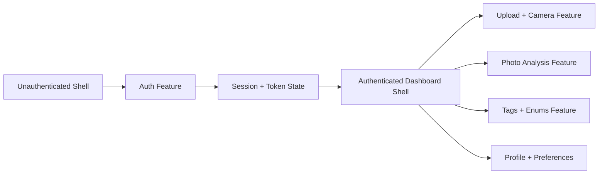

# Implementation Frontend Plan

## Goal
Build a production-ready Angular 18+ frontend for `thread-sense` that stays strictly coupled to the backend API contract for authentication, uploads, photo analysis, and taxonomy data. The first milestone is a clean, scalable application shell that supports login/signup/forgot-password, an attractive responsive dashboard navigation system, real-time camera capture, and visual tagging flows using the provided enums.

## Scope Assumptions
- The repository is currently a blank starter, so the plan begins with Angular app bootstrap and architecture setup.
- Backend owns all business rules, enums, validation rules, and persistence. Frontend mirrors backend contracts and should not invent divergent attributes.
- The frontend should support mobile-first UX, accessibility, and future scale across many features and teams.

## Recommended Architecture
- Use a feature-first, domain-driven, standalone-component Angular architecture.
- Keep `core` for singleton services, interceptors, guards, auth/session handling, and app shell concerns.
- Keep `shared` for reusable UI components, pipes, directives, and utility helpers with no business logic.
- Keep `features` for route-level domains such as auth, dashboard, uploads, and analysis.
- Keep `layouts` for authenticated and unauthenticated shells, including sidebar, bottom navigation, and responsive app chrome.
- Prefer lazy-loaded route boundaries everywhere possible.
- Use Angular Signals for local UI state and Signal Store for medium-grained application state; reserve NgRx only for cross-cutting, highly coordinated state or if the app later becomes extremely large.

### High-level flow

## Implementation Phases

### 1) Bootstrap and application foundation
- Create a new Angular workspace with standalone APIs enabled.
- Establish environment configuration, HTTP client setup, global error handling, and route guards.
- Add a typed API layer that centralizes request/response models, serialization, and error mapping.
- Introduce linting, formatting, testing, and commit hygiene from day one.

### 2) Authentication-first experience
- Implement login, signup, and forgot-password screens with typed reactive forms.
- Add auth facade/service for login, logout, session restore, refresh token handling, and password reset flows.
- Build an `AuthInterceptor` to attach access tokens and handle refresh-token retries when the backend indicates expiry.
- Protect dashboard routes with auth and role guards.

### 3) Responsive dashboard shell
- Create an authenticated layout with an attractive sidebar on desktop and a bottom navigation bar on mobile.
- Use a single source of truth for nav items so mobile and desktop stay consistent.
- Keep sidebar and bottom bar purely presentational and drive them from route metadata.
- Use `@defer` and lazy route loading for heavy dashboard sections.

### 4) Camera capture and photo upload
- Build a photo capture experience that supports file upload and live camera capture through browser media APIs.
- Keep camera permissions, stream lifecycle, and capture state isolated in a dedicated feature service.
- Support upload cancellation, retry, and upload progress feedback.
- Send only backend-approved payloads and metadata fields.

### 5) Visual tagging and analysis
- Create analysis screens that show backend-supplied suggested tags and confidence data.
- Render enums from backend-controlled taxonomy values: `Category`, `Color`, `Season`, `Occasion`, `Style`, `Material`, `Pattern`, and `Formality`.
- Allow users to review, accept, override, or add tags only within backend rules.
- Keep the frontend as a renderer and editor of backend analysis output, not as the source of truth for classification.

### 6) Enterprise hardening
- Add i18n, observability, E2E tests, accessibility checks, performance optimization, and security controls.
- Prepare the app for multi-year maintenance with consistent folder conventions and domain boundaries.

## Proposed Folder Structure
- `src/app/core`: singletons, guards, interceptors, error handling, auth/session services, API clients, app config.
- `src/app/shared`: reusable UI, pipes, directives, utilities, form helpers.
- `src/app/layouts`: unauthenticated shell, authenticated shell, sidebar, bottom bar, header, responsive navigation.
- `src/app/features/auth`: login, signup, forgot password, reset password, session pages.
- `src/app/features/dashboard`: landing, summary, recent activity, route composition.
- `src/app/features/capture`: camera stream, upload picker, capture controls, progress, permission handling.
- `src/app/features/analysis`: photo details, suggested tags, manual corrections, save/review states.
- `src/app/features/taxonomy`: enum-driven tag selection components and backend-synced option renderers.
- `src/app/models`: shared API DTOs, view models, enums, and mapper types.
- `src/app/state`: signal stores and facades for session, user profile, uploads, and analysis.
- `src/assets`: images, icons, theme tokens, i18n bundles.
- `src/environments`: runtime environment configuration.

## Core Design Decisions
- Standalone components over NgModules for simpler boundaries and better tree-shaking.
- Signals for most local and feature state because they are lighter than global stores.
- Signal Store for orchestrated feature state like auth/session/upload workflows.
- NgRx only if the application later requires complex cross-feature event coordination, devtools time travel, or large-team conventions.
- Mobile-first layout with desktop sidebar and mobile bottom bar to maximize usability on smaller screens.
- Backend-driven taxonomy and analysis outputs to ensure exact contract alignment.

## Feature Plan by Requirement

### 1. Login, signup, forgot password
- Create `LoginPage`, `SignupPage`, `ForgotPasswordPage`, and `ResetPasswordPage`.
- Use typed reactive forms and reusable validators.
- Add password visibility toggle, inline validation messages, loading states, and backend error mapping.
- Keep form field names and payloads identical to backend DTOs.

### 2. Dashboard navigation
- Implement `AppShellLayout` with responsive navigation.
- Desktop: collapsible sidebar with icon + label groups.
- Mobile: bottom bar with the top-level routes only.
- Use route data to define labels, icons, badges, and authorization visibility.

### 3. Upload and live camera capture
- Add `CapturePage` with upload picker, camera preview, capture button, retake flow, and permission states.
- Use `MediaDevices.getUserMedia` for real-time capture and canvas or `ImageCapture`-style extraction where supported.
- Provide fallback UX when camera permissions are denied.

### 4. Analyze and suggest visual tagging
- Add `AnalysisPage` that shows the uploaded photo, extracted metadata, and backend suggestions.
- Present confidence scores and allow manual correction before saving.
- Keep tag editing decoupled from analysis logic so the same components can support future models.

### 5. Enum-driven tagging system
- Generate strongly typed enums from backend contract or shared schema.
- Use a single taxonomy presentation layer to render chips, selects, and filter controls for all enum groups.
- Do not duplicate enum values in UI constants unless they are generated or versioned from the backend.

## API Layer Strategy
- Create a thin API client per domain: auth, profile, upload, analysis, taxonomy.
- Use request/response DTOs and mapping functions to separate backend contracts from UI view models.
- Centralize HTTP error normalization so forms and pages receive consistent messages.
- Add request cancellation for camera changes, search-like queries, and route transitions.
- Include retry only for safe idempotent calls and only for backend-approved failure classes.

## State Management Strategy
- Session/auth state: Signal Store or facade backed by Signals.
- Form-local state: component signals and reactive forms.
- Upload/capture state: feature-scoped store.
- Shared taxonomy/reference data: cached signal-based service with TTL or invalidation hooks.
- Server state: cached in service layer; do not overuse global state for backend data that is page-specific.

## Routing Strategy
- Public routes: login, signup, forgot password, reset password.
- Protected routes: dashboard, capture, analysis, settings, profile.
- Lazy load every feature route.
- Use guards for auth and role checks.
- Use resolvers only for data that must exist before render; otherwise prefer skeleton states and incremental loading.
- Define breadcrumbs from route metadata plus backend-supplied labels where needed.

## Performance and UX
- Enable OnPush everywhere by default.
- Use `@defer` for heavy widgets, camera helpers, and non-critical sections.
- Virtualize long lists and tag pickers when data grows large.
- Use `trackBy` for all repeated collections.
- Optimize images with lazy loading, correct sizing, and compressed uploads where appropriate.
- Measure Core Web Vitals and keep the first authenticated dashboard render light.

## Security
- Treat all tokens as sensitive and prefer HttpOnly refresh-token handling if backend supports it.
- Never trust frontend validation alone; mirror backend rules only for UX.
- Use CSP-friendly templates and Angular sanitization defaults.
- Avoid storing secrets in localStorage unless there is a documented backend-driven reason and a risk acceptance decision.
- Validate upload MIME types, dimensions, and file sizes on the client before sending, but enforce all checks again on the backend.

## Testing Strategy
- Unit test guards, services, mappers, validators, and stores.
- Component test auth forms, responsive nav, camera states, and tag editors.
- Add integration tests for auth flows, upload flow, and analysis save flow.
- Use Playwright for critical end-to-end journeys: sign up, login, camera capture, upload, analysis, logout.
- Protect the most business-critical routes with smoke coverage in CI.

## DevOps and Quality
- Use environment-based config for API base URLs and feature flags.
- Add ESLint, Prettier, Husky, and CI checks early.
- Integrate Sentry or equivalent for error tracking and performance monitoring.
- Add a release checklist for auth regressions, camera support, and upload reliability.
- Track technical debt by domain so each feature area can be owned independently.

## Common Mistakes to Avoid
- Putting all state in one global store too early.
- Mixing backend DTOs directly into templates without mapping.
- Using modules or shared barrels that hide dependency boundaries.
- Making the mobile bottom bar an afterthought instead of part of the main navigation model.
- Duplicating enum values in the UI and drifting from backend truth.
- Capturing camera streams without cleaning up media tracks on route change.

## Recommended Deliverables
- A clean Angular workspace scaffold.
- Auth, dashboard shell, capture, analysis, and taxonomy features.
- Typed API contracts aligned with backend models.
- Responsive navigation for desktop and mobile.
- Production-grade testing, monitoring, and security foundations.

## Production Readiness Checklist
- Authentication and refresh flow verified against backend.
- Route protection and role visibility tested.
- Upload and camera flows validated on target browsers and mobile devices.
- Suggested tags and enum rendering match backend schema exactly.
- Error handling, telemetry, and accessibility checks are in place.
- CI passes lint, unit, component, and E2E tests before release.

## Next Step
After this plan is approved, implement the Angular scaffold and core feature slices in this order: auth, shell/navigation, capture/upload, analysis/tagging, then observability and hardening.