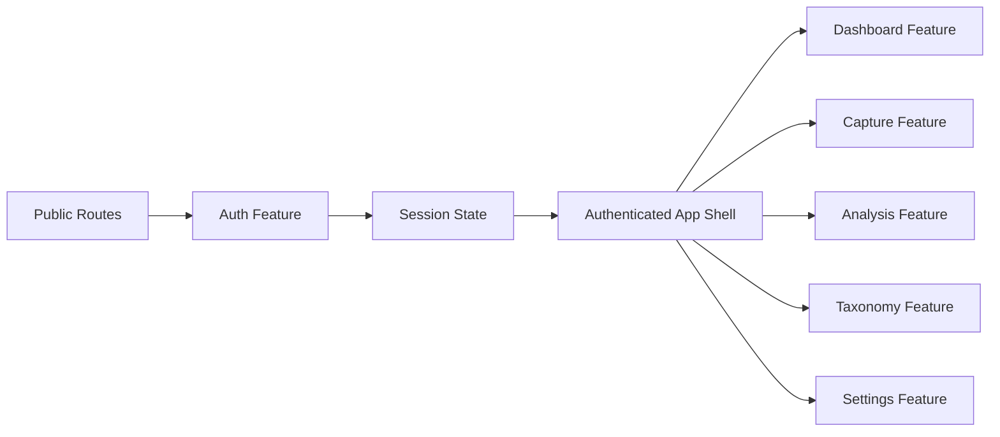
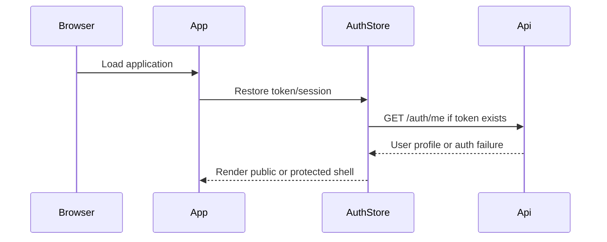
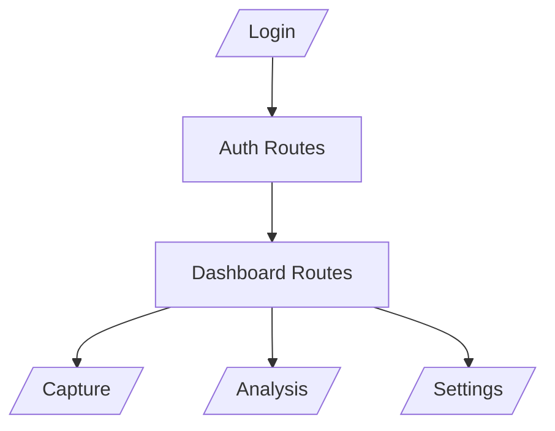
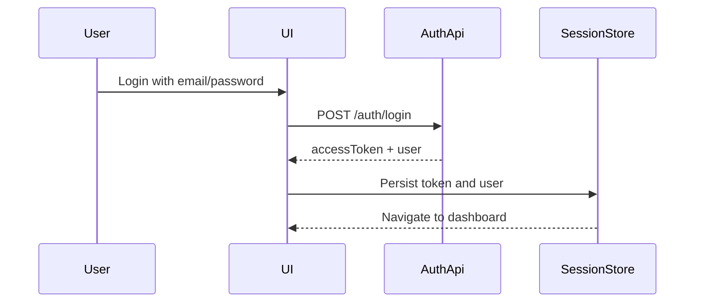

# Thread Sense Frontend Implementation Plan

## 1. Objective

Build a production-ready Angular 18+ frontend for `thread-sense` that is tightly coupled to the backend API contract and optimized for a large-team, long-lived product.

The frontend must support:
- Email/password sign up and login
- Forgot password flow
- Responsive dashboard navigation with desktop sidebar and mobile bottom bar
- Photo upload and live camera capture
- Backend-driven visual analysis and tagging
- Strong maintainability, accessibility, performance, and security practices

This document is intentionally frontend-only. All business rules, validation constraints, enums, and API attributes must remain aligned with the backend system.

---

## 2. Current Backend Contract

The frontend must match the existing backend endpoints and payload shapes exactly.

### Auth

- `POST /auth/register`
  - Body: `{ email, password }`
- `POST /auth/login`
  - Body: `{ email, password }`
  - Response: `{ accessToken, user }`
- `GET /auth/me`
  - Requires JWT auth
- `POST /auth/verify-email`
  - Body: `{ token }`
- `POST /auth/resend-verification`
  - Body: `{ email }`
- `POST /auth/forgot-password`
  - Body: `{ email }`
- `POST /auth/reset-password`
  - Body: `{ token, password }`

### Images

- `POST /images/upload`
  - Auth required
  - Multipart form field: `file`
  - Optional body fields for tags:
    - `category`
    - `color`
    - `season`
    - `occasion`
    - `style`
    - `material`
    - `pattern`
    - `formality`
- `GET /images`
  - Auth required
- `PATCH /images/:id/tags`
  - Auth required
  - Body contains the same optional tag fields as upload

### Taxonomies

- `GET /taxonomies`
  - Returns the backend-controlled enum values for:
    - `category`
    - `color`
    - `season`
    - `occasion`
    - `style`
    - `material`
    - `pattern`
    - `formality`

### Backend enum values

The frontend must render backend values for:

```ts
enum Category { tops bottoms dresses outerwear shoes accessories bags activewear }
enum Color { black white gray navy blue green red pink yellow orange brown beige purple multicolor }
enum Season { spring summer fall winter all_season }
enum Occasion { casual work formal party date travel sport }
enum Style { minimal classic streetwear boho preppy athleisure vintage }
enum Material { cotton linen wool silk denim leather synthetic knit }
enum Pattern { solid striped checked floral printed graphic other }
enum Formality { very_casual casual smart_casual business formal }
```

The frontend should not duplicate these values manually unless they are generated from the backend contract or a shared schema package.

---

## 3. Recommended Frontend Architecture

Use a feature-first, domain-driven Angular architecture with standalone components.

### Why this approach

- Scales better than a module-heavy structure
- Keeps route-level features isolated
- Makes lazy loading straightforward
- Reduces coupling between presentation and domain logic
- Fits Angular 18+ best practices

### Core principles

- Standalone components only
- Lazy-load every route boundary
- Use Signals for local and feature state
- Use Signal Store or a lightweight facade for cross-component state
- Keep backend DTOs separate from UI view models
- Keep reusable UI in `shared`
- Keep singletons and global services in `core`

### Architecture flow



---

## 4. Enterprise Folder Structure

Use a clear, scalable folder layout.

```text
src/
  app/
    core/
      auth/
      guards/
      interceptors/
      services/
      config/
      error-handling/
    shared/
      components/
      directives/
      pipes/
      utils/
      validators/
      models/
    layouts/
      auth-layout/
      app-shell-layout/
      sidebar/
      bottom-nav/
      topbar/
    features/
      auth/
        login/
        signup/
        forgot-password/
        reset-password/
        verify-email/
      dashboard/
      capture/
      analysis/
      taxonomy/
      profile/
      settings/
    state/
      session.store.ts
      user.store.ts
      upload.store.ts
      analysis.store.ts
      taxonomy.store.ts
    models/
      api/
      auth/
      image/
      taxonomy/
      shared/
    routes/
      app.routes.ts
      auth.routes.ts
      dashboard.routes.ts
  assets/
    icons/
    images/
    themes/
    i18n/
  environments/
    environment.ts
    environment.development.ts
    environment.production.ts
```

### Folder purpose

- `core`: singleton services, interceptors, guards, app config, auth/session handling
- `shared`: reusable UI building blocks and utility functions
- `layouts`: shell wrappers and navigation chrome
- `features`: business-facing route modules by domain
- `state`: feature stores and facades
- `models`: backend DTOs, enums, and UI mapping types
- `routes`: centralized route definitions for lazy-loaded features

---

## 5. Application Bootstrap Strategy

### Initial setup

1. Create or migrate the web frontend to Angular 18+.
2. Enable standalone component bootstrap.
3. Configure routing, HTTP client, and global error handling.
4. Add environment-based API URLs.
5. Set up linting, formatting, and tests before feature development.

### Bootstrapping priorities

- Auth shell and route guards
- Session restore on app start
- Shared API client and error handling
- Responsive application shell

### App startup flow



---

## 6. Angular Standards

### Coding conventions

- Prefer small, focused components
- Avoid shared mutable state unless it is intentionally centralized
- Keep templates declarative and simple
- Use `OnPush` change detection by default
- Prefer `inject()` where it improves readability

### Naming conventions

- Components: `login-page.component.ts`
- Services: `auth-api.service.ts`, `session.store.ts`
- Routes: `auth.routes.ts`, `dashboard.routes.ts`
- Models: `login-request.model.ts`, `image-response.model.ts`
- Guards: `auth.guard.ts`, `guest.guard.ts`

### TypeScript best practices

- Use strict typing everywhere
- Prefer interfaces or type aliases for DTOs
- Never use `any`
- Avoid `enum` in UI when backend generated string unions are enough
- Use narrow types for event handlers and response models

### Clean Architecture alignment

Keep dependencies pointing inward:

- Components depend on facades and view models
- Facades depend on API services and stores
- API services depend on typed transport helpers
- Transport helpers depend on `HttpClient`

---

## 7. State Management Strategy

### Recommended split

- **Local UI state**: Signals inside components
- **Feature state**: Signal Store or a small facade/store pattern
- **Session state**: Central auth/session store
- **Reference data**: cached taxonomy service
- **Server state**: keep close to the feature that uses it

### Recommended use of Signals

Use Signals for:
- Form display state
- Navigation state
- Camera permission state
- Selected image preview
- Taxonomy selections

Use computed signals for:
- Derived form validity summaries
- Dynamic tag counts
- Navigation badge visibility
- Upload readiness state

Use effects for:
- Session bootstrap
- Redirects after login/logout
- Persisting non-sensitive UI preferences
- Camera stream cleanup

### NgRx recommendation

Do not introduce NgRx by default for this product.

Use NgRx only if later you need:
- Cross-feature event orchestration at scale
- Time-travel debugging
- Strict team-wide state conventions
- Complex server state synchronization across many screens

### Cache strategy

- Cache `/taxonomies` in memory with invalidation on app reload or backend version change
- Cache `GET /images` results by feature route lifecycle
- Do not cache sensitive auth state beyond what is needed for session restore

---

## 8. Routing and Navigation

### Route structure

- Public routes:
  - `/login`
  - `/signup`
  - `/forgot-password`
  - `/reset-password`
  - `/verify-email`
- Protected routes:
  - `/dashboard`
  - `/capture`
  - `/analysis`
  - `/settings`
  - `/profile`

### Navigation UX

Create one navigation model and render it in both desktop and mobile shells:

- Desktop: sidebar with labels and icons
- Mobile: bottom bar with the most important top-level routes

### Route handling rules

- Lazy-load every route group
- Use guards for auth protection
- Use role visibility metadata for menu visibility
- Use route resolvers only when blocking render is necessary
- Prefer skeleton/loading states over hard blocking

### Breadcrumb strategy

Use route metadata plus backend labels where needed.

### Routing diagram



---

## 9. API Layer Design

### Service boundaries

Create dedicated services for:
- `auth-api.service.ts`
- `taxonomies-api.service.ts`
- `images-api.service.ts`
- `session.service.ts`

### Rules

- Keep HTTP calls thin and domain-specific
- Map backend DTOs to UI models in one place
- Normalize errors centrally
- Centralize auth header injection in an interceptor
- Use request cancellation where the user can rapidly change context

### Example API wrapper

```ts
export interface LoginRequestDto {
  email: string;
  password: string;
}

export interface LoginResponseDto {
  accessToken: string;
  user: {
    id: string;
    email: string;
    emailVerified: boolean;
  };
}
```

### Upload payload

Use `FormData` with the exact backend field name:

```ts
const formData = new FormData();
formData.append('file', file);
formData.append('category', value ?? '');
```

### Error handling

Map known backend errors to user-friendly UI messages:

- Invalid credentials
- Email not verified
- Token expired
- File too large
- Unsupported image type
- Image not found

---

## 10. Authentication and Authorization

### Current backend reality

The backend currently returns a JWT `accessToken` on login and validates access via `GET /auth/me`.

There is no refresh-token endpoint in the current contract, so the frontend must not depend on one unless the backend is extended later.

### Frontend implementation

- Store the access token in a session-aware location
- Restore session on app startup with `GET /auth/me`
- Protect private routes with an auth guard
- Redirect unauthorized users to login
- Handle expired or invalid tokens by clearing session state and redirecting to `/login`

### RBAC

Build role-aware route metadata in the UI even if the current backend returns only basic user data.

This keeps the frontend ready for future role expansion without changing the shell architecture.

### Auth flow



### Secure storage recommendation

Preferred order:
1. HttpOnly cookies if backend is extended to support them
2. Session storage for the current backend
3. Local storage only if persistence across browser restarts is a hard requirement

---

## 11. Forms Strategy

### Forms to build

- Login form
- Sign up form
- Forgot password form
- Reset password form
- Tag editing forms
- Profile and settings forms

### Form approach

- Use typed reactive forms
- Centralize validators and error message maps
- Use reusable form field components
- Keep form state local unless it spans multiple steps

### Validation

Mirror backend validation:
- email format
- minimum password length of 8

### Form UX

- Inline validation
- Submit loading state
- Disable submit until valid
- Preserve typed values on API failure
- Map server validation errors to field messages

---

## 12. UI and UX Architecture

### Design system

Use Angular Material as the base component library, then layer a lightweight brand theme on top.

### Why Angular Material

- Accessible by default
- Strong form controls and dialogs
- Mature theming support
- Good fit for enterprise applications

### Layout recommendations

- Desktop:
  - Left sidebar
  - Top summary bar
  - Main content region
- Mobile:
  - Bottom bar
  - Simplified content hierarchy
  - Clear capture button placement

### Responsive strategy

- Mobile-first CSS
- Use breakpoints for sidebar collapse
- Preserve thumb-friendly action placement
- Keep navigation icons large enough for touch

### Dark mode

- Support system and user-selected themes
- Store theme preference in a non-sensitive preference store
- Keep tokens centralized in CSS variables

### Accessibility

Follow WCAG-oriented practices:
- Keyboard navigable controls
- Visible focus states
- Screen-reader labels
- Sufficient contrast
- Semantic landmarks

---

## 13. Reusable Components Strategy

### Build a shared library of UI components

- Buttons
- Inputs
- Password input
- Page header
- Empty state
- Loading skeleton
- Confirmation dialog
- Tag chips
- Image preview card
- Bottom nav item
- Sidebar nav item

### Smart vs dumb components

- Smart components own data fetching and orchestration
- Dumb components receive inputs and emit outputs

### Composition patterns

- Use content projection for flexible shells
- Use input/output APIs for simple composition
- Avoid deep component inheritance

---

## 14. Photo Upload and Live Camera Capture

### Required UX

- Upload from device storage
- Live camera capture
- Retake image
- Permission denied state
- Upload progress
- Preview before tagging

### Implementation approach

- Use `navigator.mediaDevices.getUserMedia`
- Stop all media tracks when leaving the page
- Capture a frame to canvas when the user confirms
- Support file upload fallback for devices without camera permissions

### Capture state

- idle
- requesting-permission
- streaming
- captured
- uploading
- success
- failed

### Important rules

- Never keep camera streams running in the background
- Validate MIME type and file size before upload
- Keep the frontend preview separate from the persisted image model

---

## 15. Visual Tagging and Analysis

### Tagging model

The frontend must use the backend-controlled tag groups:
- `category`
- `color`
- `season`
- `occasion`
- `style`
- `material`
- `pattern`
- `formality`

### UX rules

- Show the uploaded image
- Show backend suggestions clearly
- Let users accept or edit suggested values
- Render all enum options from `/taxonomies`
- Keep manual tag overrides explicit

### Suggested analysis screen

- Image preview
- Suggested tags
- Confidence and metadata panel
- Editable taxonomy selector
- Save / update tags action

### Tag rendering strategy

Use a single taxonomy component that can render:
- single-select chips
- select dropdowns
- filter pills
- read-only summary tags

### Important constraint

The frontend must not invent new tags or classification logic outside the backend contract.

---

## 16. Performance Optimization

### Must-have optimizations

- `OnPush` everywhere
- Lazy loading for all route features
- `@defer` for non-critical dashboard sections
- `trackBy` in all repeated lists
- Virtual scroll for large image or tag lists
- Lazy image loading

### Dashboard performance

- Keep the first authenticated render light
- Defer analytics-heavy widgets
- Load taxonomy reference data only when needed

### Camera performance

- Pause or stop streams when hidden
- Avoid unnecessary re-renders during preview
- Use small, focused state updates

---

## 17. Security Best Practices

### Frontend security responsibilities

- Never trust client-side validation alone
- Keep JWT handling minimal and explicit
- Sanitize all dynamic HTML
- Avoid unsafe DOM APIs
- Use Angular’s built-in escaping and sanitization

### CSRF and tokens

If the backend later moves to cookie-based auth, the frontend must support CSRF-safe request handling.

For the current access-token flow:
- Protect token persistence
- Clear session state on unauthorized responses
- Avoid exposing secrets in logs

### Environment handling

- Keep API URLs in environment files
- Do not hardcode secrets in frontend source
- Do not expose private keys or service credentials in the browser bundle

---

## 18. Error Handling, Logging, and Observability

### Global error strategy

- Global error handler for unhandled runtime exceptions
- HTTP interceptor for API failure normalization
- User-friendly toast/banner messages
- Retry only for safe operations

### Logging

- Log only non-sensitive client diagnostics
- Redact tokens and personal data
- Keep stack traces in monitoring tools, not visible UI

### Monitoring

Integrate:
- Sentry for error tracking
- Performance monitoring
- Session replay only if privacy policy allows it

### Frontend observability targets

- Auth failures
- Upload failures
- Camera permission issues
- Analysis save failures
- Route guard redirects

---

## 19. Internationalization

### i18n strategy

- Prepare all user-facing strings for translation
- Keep locale bundles separate
- Avoid hardcoding text inside complex templates

### RTL support

Design the layout to support RTL later by:
- Using logical CSS properties where possible
- Avoiding hardcoded left/right spacing logic in shared components

### Locale handling

- Store user locale preference
- Respect browser locale as a default
- Keep date and number formatting centralized

---

## 20. Testing Strategy

### Unit tests

Cover:
- Validators
- Guards
- Interceptors
- API mappers
- Store logic

### Component tests

Cover:
- Login/signup forms
- Forgot/reset flows
- Sidebar and bottom nav
- Camera capture states
- Tag selector behavior

### Integration tests

Validate:
- Auth session bootstrap
- Image upload flow
- Tag update flow
- Taxonomy loading

### E2E tests with Playwright

Critical journeys:
- Sign up
- Login
- Forgot password
- Reset password
- Upload image
- Capture photo
- Edit tags
- Logout

### Coverage strategy

- High coverage for auth and upload flows
- Medium coverage for shared UI
- Smoke coverage for route shell and navigation

---

## 21. DevOps and CI/CD

### Build pipeline

- Install dependencies
- Lint
- Unit tests
- Component tests
- E2E smoke tests
- Production build

### Environment strategy

- `development`
- `staging`
- `production`

Each environment should point to the correct backend API URL and feature flag set.

### Deployment strategy

- Deploy frontend independently from backend
- Use immutable builds
- Promote the same artifact across environments

### Feature flags

Use flags for:
- New dashboard navigation patterns
- Camera enhancements
- Tagging UX experiments
- Future AI-assisted suggestions

---

## 22. Code Quality

### Tooling

- ESLint
- Prettier
- Husky
- lint-staged
- CI enforcement

### Quality gates

- No lint violations
- No type errors
- No untested critical flows
- No API contract drift

### Technical debt management

- Track debt by feature area
- Keep refactors isolated
- Avoid “shared” dumping grounds

---

## 23. Recommended Tech Stack

### Angular ecosystem

- Angular 18+ / 19+ / 20+ compatible setup
- Standalone components
- Signals
- Angular Router
- HttpClient

### State

- Signals
- Signal Store or facade-based stores
- NgRx only if future complexity demands it

### UI

- Angular Material
- CSS variables for theming
- Optional lightweight utility CSS if the team prefers it

### Testing

- Jasmine/Karma or Jest for unit/component tests
- Playwright for E2E

### Monitoring

- Sentry
- Browser performance analytics
- Optional product analytics

### Build tooling

- Angular CLI
- ESLint
- Prettier
- Husky

---

## 24. Production Readiness Checklist

### Architecture

- [ ] Standalone, feature-first architecture in place
- [ ] Lazy loading for all route-level features
- [ ] Clear separation of core, shared, layouts, and features
- [ ] DTOs separated from UI models

### Security

- [ ] Auth handling aligned with backend JWT flow
- [ ] No secret leakage in frontend bundle
- [ ] Input validation and sanitization applied
- [ ] Error handling avoids sensitive data exposure

### Performance

- [ ] OnPush used broadly
- [ ] Heavy widgets deferred
- [ ] Long lists virtualized
- [ ] Images optimized

### Testing

- [ ] Auth flows tested
- [ ] Upload/capture tested
- [ ] Tag editing tested
- [ ] Playwright smoke suite passing

### Deployment

- [ ] Environment configs verified
- [ ] API URLs correct per environment
- [ ] Monitoring configured
- [ ] Release checklist documented

---

## 25. Suggested Implementation Order

Implement the frontend in this sequence:

1. Workspace/bootstrap and global app shell
2. Auth flows: login, signup, forgot password, reset password, verify email
3. Auth/session store, interceptor, guards, and route protection
4. Responsive dashboard layout with sidebar and mobile bottom nav
5. Taxonomy service and enum rendering components
6. Image upload flow
7. Live camera capture flow
8. Analysis and tag editing flow
9. Error handling, logging, monitoring, and hardening
10. Testing, performance tuning, and production readiness

---

## 26. Final Recommendation

Use Angular as a clean, standalone, feature-based frontend with strict backend contract alignment.

For this product, the highest priorities are:
- Reliable auth flow
- Mobile-friendly navigation
- Fast upload and camera capture
- Exact enum-driven tag rendering
- Strong maintainability for a long-lived codebase

Do not let the frontend drift from the backend DTOs or enum values. Treat `/auth`, `/images`, and `/taxonomies` as the single source of truth for the UI contract.
